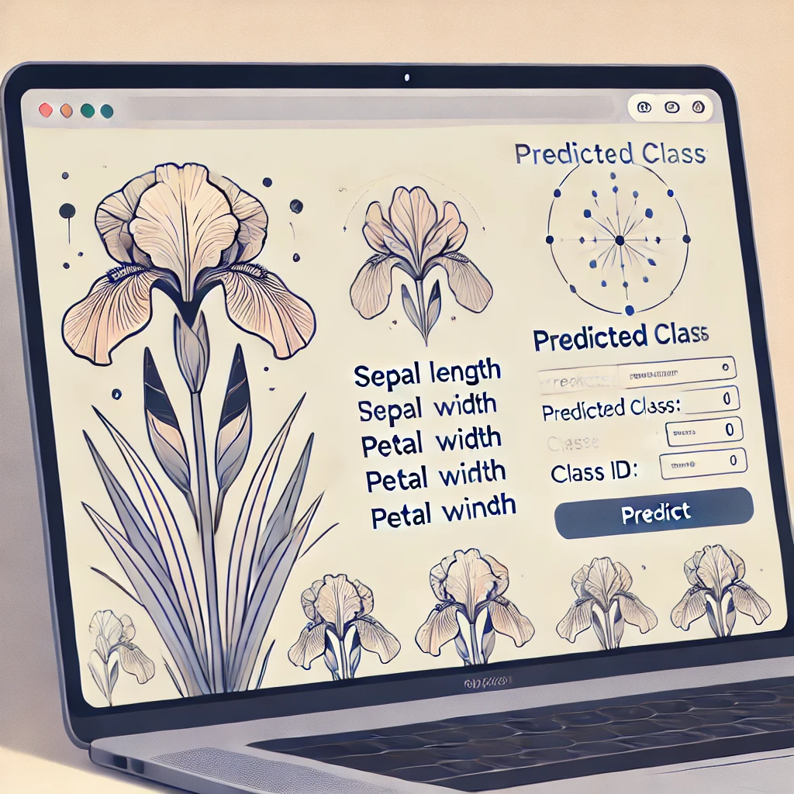
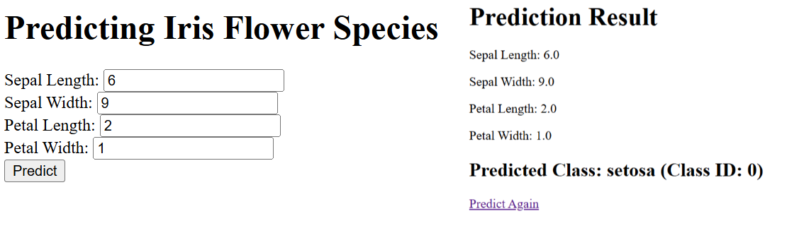
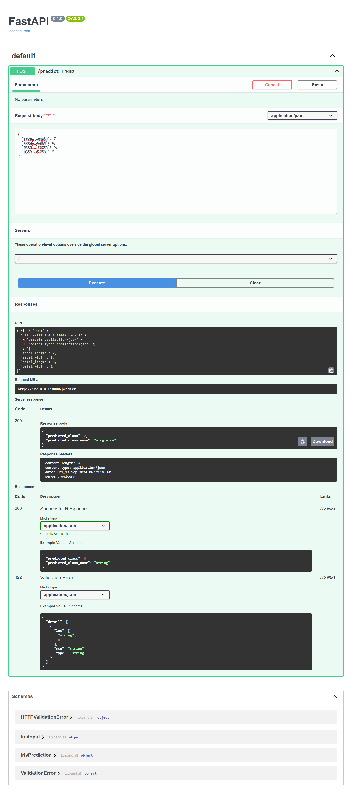

# Iris Flower Prediction App with FastAPI

This project is a web application for predicting the species of Iris flowers using a machine learning model trained with the Iris dataset. The app is built using FastAPI, a modern web framework for building APIs with Python 3.7+.



## Features

- **Iris Flower Species Prediction**: The app predicts the species of an Iris flower based on its sepal and petal dimensions.
- **Interactive Web Interface**: Users can input flower dimensions via a web form.
- **REST API Endpoint**: The application also provides an API endpoint for programmatic predictions.

## Technology Stack

- **Python**: The programming language used for building the application.
- **FastAPI**: A modern, fast (high-performance), web framework for building APIs with Python.
- **Scikit-Learn**: A popular machine learning library in Python used for training the classification model.
- **Jinja2**: A templating engine for Python, used for rendering HTML templates.

## How to Run the Application

### Prerequisites

- Python 3.7 or higher
- `pip` (Python package installer)
- Virtual environment (recommended)

### Setup Instructions

1. **Clone the repository:**

    ```bash
    git clone https://github.com/presiZHai/iris-predictor-fastapi.git
    cd iris-predictor-fastapi

2. **Create and activate a virtual environment**

    ```bash
    conda create --name iris-predictor pythn=3.10 -y
    conda activate iris-predictor
    ```

3. **Install the required dependencies**

    ```bash
    pip install -r requirements.txt
    ```

4. **Train the model**

Run the following command to train the model. This will create a file named iris_model.pkl containing the trained model.
    ```bash
    python train_model.py
    ```

5. **Run the application**

You can start the FastAPI application by running:
    ```bash
    python app.py
    ```
The application will be available at http://127.0.0.1:8000.



## API Usage

Endpoint
* POST /predict: Predicts the species of an Iris flower.

Request Body
    ```json
    {
    "sepal_length": 5.1,
    "sepal_width": 3.5,
    "petal_length": 1.4,
    "petal_width": 0.2
    }
Response
    ```json
    {
    "predicted_class": 0,
    "predicted_class_name": "setosa"
    }



## HTML Templates
* index.html: The main page where users can input flower dimensions for prediction.
* result.html: Displays the prediction result after submitting the form.

## Contributing
* Contributions are welcome! Please feel free to submit a Pull Request.

## License
* This project is licensed under the MIT License. See the LICENSE file for details.

## Acknowledgments
* The Iris dataset is used in this project, which is a popular dataset for classification and machine learning tasks.
* Thanks to the creators of FastAPI and Scikit-Learn for their excellent tools.